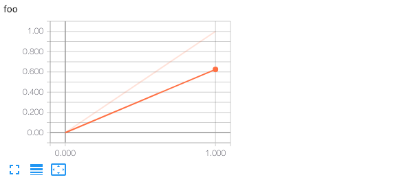

# tensorboard_screenshot

It can be real tedious manually taking screenshots of TensorBoard graphs for work logs. So let's automate it!

## Usage

* Install [Node.js](https://nodejs.org) (e.g. `brew install node`)
* Install [Puppeteer](https://github.com/GoogleChrome/puppeteer) (`npm i puppeteer`)
* Run with:
```
$ node tensorboard_screenshot.js <TensorBoard instance URL>
```
* Screenshot of all scalar graphs will be saved as `screenshot.png`.

## Example

```
$ python3 -c "from easy_tf_log import tflog; tflog('foo', 0); tflog('foo', 1)"
$ tensorboard --logdir logs &
TensorBoard 1.12.1 at http://localhost:6006 (Press CTRL+C to quit)
$ node tensorboard_screenshot.js localhost:6006
Starting browser...
Waiting for page to finish loading...
Found 2 graphs
Screenshot saved to screenshot.png
```


